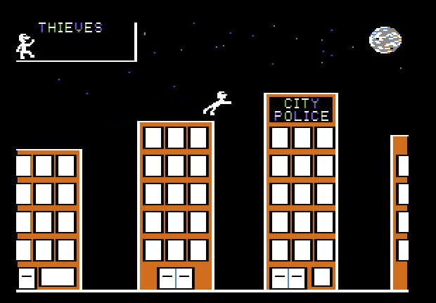

# About Heist-Apple-II

This repo contains 6502 assembler source for parts of a game called Heist, developed in 1983-1984 by Darin Young, Dennis Henry, and Chuck Shnider. The code is an accompaniment to my January, 2016 Cocoaheads talk: *A look back at Apple II Gamedev*.

Only 2 of 4 planned levels were ever developed.

## Heist Level I

## Heist Level III

Currently, only the assembler source for the game is included in the repo. Over time, I may include source for some asset generation tools, etc. These were written in a mix of Applesoft BASIC and assembler.

The assembler source format is that used by Apple's "EDASM" assembler.
